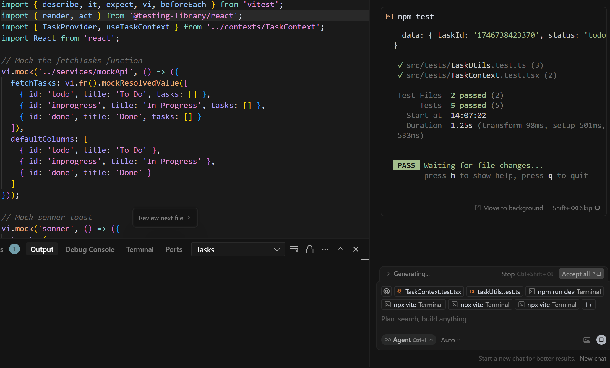
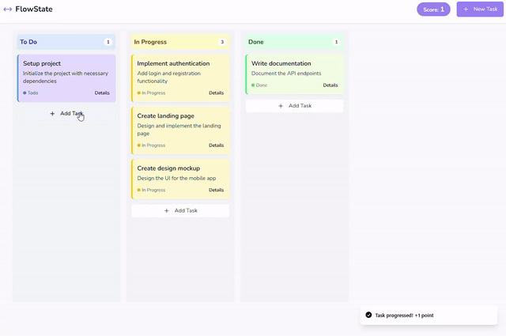
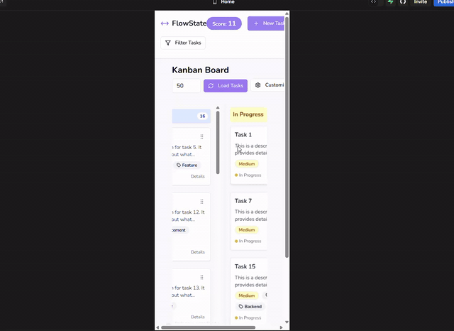

# Kanban Board Application

## Summary
Named "Flow State" in reference to Mihaly Csikszentmihalyi's foundational work in occupational science, which articulated the concept of "flow" - a state of optimal experience that is now central to our understanding of engagement and enjoyment in work and play. I aim to create a seamless, engaging task management experience that helps users achieve this state of focused productivity.

## Description
This project involves developing a Kanban app in React that allows users to:
- Add tasks with metadata.
- Move tasks between different sections of the board.
- Perform metadata operations like filtering and sorting.

The app should be built using **React** and can utilize **Vite** for build setup. You are encouraged to use AI tools (e.g., GPT, Cursor) to assist in development.

## Project Demo


*Figure 1: Demonstration of the Kanban board application showing task management, drag-and-drop functionality, and responsive design*

## Live Demo
Try out the product live at [https://astrocade.charliefeuerborn.com/](https://astrocade.charliefeuerborn.com/)

The app is fully responsive and works on both mobile and desktop web browsers.

---

## Deliverables
1. Commit your code to a Git repository.
2. Share the repository with:
   - kent@astroblox.ai
   - ali@astroblox.ai
3. Record your development process, design choices, and time spent on each section in this README.

---

## Timeframe
- **Estimated Implementation Time:** 2-4 hours.

---

## Requirements

### Core Features
- **Configurable Sections:** Implement stages for tasks (e.g., To Do, Doing, Review, Done) that are configurable.
- **Drag and Drop Functionality:** Enable smooth and snappy animations when moving tasks between sections.
- **Task Creation UI:** Allow users to add tasks with metadata (e.g., name, description, date, priority, assignee, etc.).
- **Task Detail View:** Enable tapping on tasks to view detailed information.
- **Metadata Filtering:** Allow filtering of tasks across all stages by metadata (e.g., tasks due after a certain date).
- **Responsive UI:** Ensure the app works seamlessly in both landscape and portrait orientations.
- **Performance:** Optimize for large numbers of tasks (support at least 1,000 tasks simultaneously).
---

## Technologies Used
This project is built with:
- Vite
- TypeScript
- React
- shadcn-ui
- Tailwind CSS

## Setup Instructions
1. **Prerequisites:**
   - Node.js & npm installed (recommended to install with [nvm](https://github.com/nvm-sh/nvm#installing-and-updating))

2. **Installation:**
   ```bash
   # Clone the repository
   git clone <repository-url>
   
   # Navigate to project directory
   cd <project-directory>
   
   # Install dependencies
   npm install
   
   # Start development server (configured for Windows 11)
   npm run dev
   ```

3. **Development:**
   - The development server will start with auto-reloading and instant preview
   - Open your browser to view the application

4. **Mobile Testing:**
   - To access the app on mobile devices:
     1. Find your computer's local IP address (e.g., using `ipconfig` on Windows or `ifconfig` on Mac/Linux)
     2. Update the Vite config to listen on all network interfaces:
        ```js
        // vite.config.ts
        export default defineConfig({
          server: {
            host: '0.0.0.0'
          }
        })
        ```
     3. Access the app on your mobile device by navigating to `http://<your-local-ip>:5173` in your mobile browser
     4. Ensure your mobile device is connected to the same local network as your development machine

5. **Testing:**
   ```bash
   # Run tests
   npm run test
   ```

   

   *Figure 1: Example test output showing successful test execution*

   For detailed information about the test implementation, see [TESTS.md](./TESTS.md). The test suite covers core functionality, error handling, and component interactions.

## Development Progress

### Phase 1: Kanban Board Draft 1 with Points


*Video 1: Initial implementation of the Kanban board with gamification points (1 point per task created, 1 point per forward movement towards completion - distinct from Scrum story points)*

### Phase 2: Kanban Board Draft 2 with More Metadata


*Video 2: Enhanced task metadata and improved task management*

### Phase 3: Kanban Board Draft 3 with Category Customization and Filtering


*Video 3: Added category customization and advanced filtering capabilities*

### Phase 4: Kanban Board Draft 4 with Reactive Requirements


*Video 4: Implemented reactive requirements and real-time updates*

### Phase 5: Kanban Board Draft 5 with Task Dragging


*Video 5: Added smooth task dragging functionality and performance optimizations*

### Abandoned Feature: Confetti Celebration


*Video 6: Initial implementation of confetti celebration (later replaced with audio feedback)*

### Time Spent

#### First GPT Pass (15 minutes)
- **Drag and Drop Functionality:** 5 minutes
- **Task Creation UI:** 5 minutes
- **Task Detail View:** 5 minutes

#### Second GPT Pass (40 minutes)
- **Metadata Filtering:** 20 minutes
- **Configurable Sections:** 20 minutes

#### Third GPT Pass (30 minutes)
- **Mock API Setup:** 15 minutes
- **Testing Setup:** 15 minutes

#### Manual Implementation and Debugging (35 minutes)
- **Responsive UI:** 10 minutes (setting up scroll area components for mobile)
- **Testing Refinement:** 5 minutes
- **Error Handling:** 5 minutes
- **Observability and Logging:** 5 minutes
- **Milestone Features:** 10 minutes (implemented sound effects and toast notifications)

**Total Time: 2 hours**

**Additional Time:**
- **Video Capture and Presentation:** 30 minutes

## Scoping and Tradeoffs

### Time Management
- Focused on creating a solid foundation for testing and logging while maintaining a polished user experience
- Prioritized the core functionality and "feel" of the app over additional features
- Balanced complexity against product requirements to deliver a functional MVP within the time constraint

### Deliberate Limitations
- Task details are not editable after creation (would be a trivial feature to add)
- This limitation was accepted to focus on demonstrating core functionality:
  - Category management
  - Task tracking and movement
  - Gamification with points
  - Responsive design
  - High level of interactivity
- Tasks are procedurally generated via the API for testing purposes:
  - Use the "Load Tasks" button to generate randomized tasks
  - Adjust the number input to test different volumes of tasks
  - This feature helps demonstrate filtering capabilities and performance with large datasets
- The task and card components are designed to be extensible:
  - Editing functionality can be added with minimal dependencies
  - The architecture supports easy addition of new features without major refactoring

### Future Improvements
The current implementation provides a strong foundation for future enhancements, with the most critical features (task management, categorization, and gamification) fully functional and well-tested.

## Design Choices

### Architecture
- **Component-Based Design:** The app is structured using reusable React Native components to ensure modularity and scalability.
- **State Management:** Utilized `React Context` for lightweight state management to handle task data and board configurations.
- **Mock API Integration:** Implemented a mock API with configurable delays for testing scalability and performance. See [API.md](./API.md) for detailed API documentation.

### UI/UX
- **Modern Component Library:** Built with shadcn-ui for a clean and intuitive user interface
- **Animations:** Implemented smooth drag-and-drop interactions
- **Milestone Feedback:** Toast notifications and score tracking for task completion milestones

### Tradeoffs
- **Performance vs. Features:** Focused on optimizing for 1,000+ tasks, which limited the complexity of animations.
- **Mock API vs. Real Backend:** Chose a mock API to simplify development and testing within the given timeframe. The API implementation is documented in [API.md](./API.md).
- **Feature Scope:** Initially implemented visual confetti effects for milestones but replaced with simpler audio feedback to focus on testing and core functionality.

---

## How to Run

1. **Install Dependencies:**
    ```bash
    npm install
    ```

2. **Start the Development Server:**
    ```bash
    npm run dev
    ```

3. **Access on Mobile Devices:**
   - Find your computer's local IP address (e.g., using `ipconfig` on Windows or `ifconfig` on Mac/Linux)
   - Update the Vite config to listen on all network interfaces:
     ```js
     // vite.config.ts
     export default defineConfig({
       server: {
         host: '0.0.0.0'
       }
     })
     ```
   - Access the app on your mobile device by navigating to `http://<your-local-ip>:5173` in your mobile browser
   - Ensure your mobile device is connected to the same local network as your development machine
   - Or access the live version at [https://astrocade.charliefeuerborn.com/](https://astrocade.charliefeuerborn.com/)

---

## Notes

- **Assumptions:**
  - Tasks are fetched from a mock API and stored locally.
  - The app is optimized for mobile devices only.
- **Known Limitations:**
  - Calendar view integration is incomplete.
  - Advanced animations are minimal due to time constraints.
